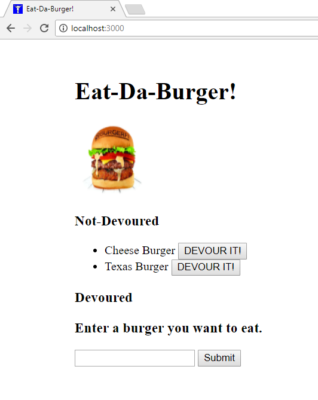
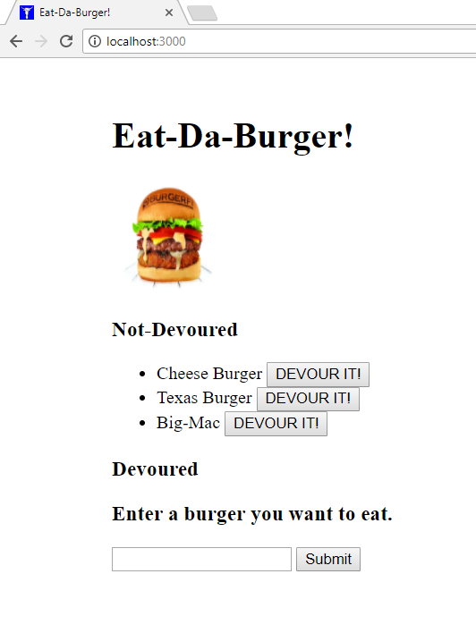
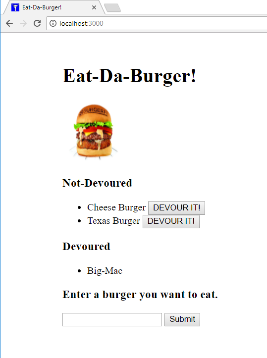
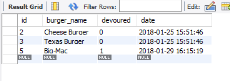

# Eat-Da-Burger

'Eat-Da-Burger' is a restaurant app that lets users input the names of burgers they'd like to eat.  
This app uses MySQL, Node, Express, Handlebars and a homemade ORM. 
It follows the MVC design pattern and uses Node and MySQL to query and route data in the app, and Handlebars to generate the HTML.

### Eat-Da-Burger Main Page

***

Whenever a user submits a burger's name, this app will display the burger on the not-devoured section -- waiting to be devoured.

***

Each burger in the waiting area also has a "Devour it!" button. When the user clicks it, the burger will move to the devoured section.

***

This app will store every burger in a database, whether devoured or not.

